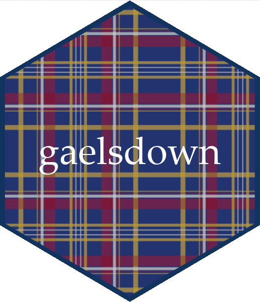

<!-- README.md is generated from README.Rmd via `devtools::build_readme()`. Please edit README.Rmd -->

```{r include=FALSE}
knitr::opts_chunk$set(
  fig.path = "man/figures/"
)
```

# gaelsdown 

The **gaelsdown** project is a branch of Chester Ismay’s
[thesisdown](https://github.com/ismayc/thesisdown) package, providing a template
for writing theses in [rmarkdown](https://rmarkdown.rstudio.com/) that can be
rendered as PDF according to the Queen's University [style and form requirements](https://github.com/eugenesit/gaelsdown/blob/master/docs/SGS_General_Forms_of_Theses_March2017.pdf).

This README provides instructions for **1) Installing the gaelsdown templates** in
[RStudio](https://www.rstudio.com/products/rstudio/) and **2) Knitting a starter document** from files
installed with the template. You can preview the document in different formats here:

-   [PDF](https://raw.githubusercontent.com/eugenesit/gaelsdown_book/master/_book/thesis.pdf)
-   [gitbook](https://eugenesit.github.io/gaelsdown_book/)
-   [Word](https://github.com/eugenesit/gaelsdown_book/raw/master/_book/thesis.docx)
-   [ePub](https://github.com/eugenesit/gaelsdown_book/raw/master/_book/thesis.epub)

*Note: Word and ePub formats are developmental only and have no underlying template*

This starter document provides a tutorial for how to use gaelsdown when writing 
and formatting your thesis. gaelsdown and thesisdown are both based on 
[bookdown](https://bookdown.org/yihui/bookdown/), and if you are new to using bookdown,
you should definitely take a read through my tutorial before diving in!

The PDF generated by this template uses LaTeX templates [provided by the Queen's
Graduate Computing Society](https://flux.cs.queensu.ca/gcs/document-preparation/latex/thesis-template-2/),
but if you are interested in using a different template to create your thesis, then take
a look at [the end of this README](https://github.com/eugenesit/gaelsdown#customizing-a-template-for-your-institution). I've also provided summary of changes from thesisdown in [News.md](https://github.com/eugenesit/gaelsdown/blob/master/NEWS.md).

## Installing gaelsdown from Eugene’s GitHub

*The following instructions are adapted from [thesisdown](https://github.com/ismayc/thesisdown), with contributions from [Ben Marwick](https://github.com/benmarwick) developed for the [README of his spin-off `huskydown` package](https://github.com/benmarwick/huskydown/blob/master/README.md).*

Using **gaelsdown** has some prerequisites which are described below. To
compile PDF documents using **R**, you are going to need to have LaTeX
installed. By far the easiest way to install LaTeX on any platform is
with the [tinytex](https://yihui.name/tinytex/) R package:

``` r
install.packages(c('tinytex', 'rmarkdown'))
tinytex::install_tinytex()
# after restarting RStudio, confirm that you have LaTeX with
tinytex:::is_tinytex()
```

To use **gaelsdown** from
[RStudio](https://www.rstudio.com/products/rstudio/download/):

1.  Ensure that you have already installed LaTeX and are using the latest version of
    [RStudio](https://www.rstudio.com/products/rstudio/download/).

2.  Install the `bookdown` and `gaelsdown` packages. Note that
    `gaelsdown` is not available on CRAN at the moment and that’s why
    `install.packages("gaelsdown")` won’t work. Use
    `devtools::install_github()` as shown below instead to install the
    package.

    ``` r
    if (!require("devtools")) 
      install.packages("devtools", repos = "https://cran.rstudio.org")
    devtools::install_github("rstudio/bookdown")
    devtools::install_github("eugenesit/gaelsdown")
    ```
    
    Note that you may need to restart RStudio at this point for the following dialog to show up.

3.  Create a new RStudio project with a **gaelsdown** template.

    In RStudio, click on **File** &gt; **New Project** &gt; **New
    Directory**. Then select **Queen's Thesis Project using gaelsdown** from
    the dropdown that will look something like the image below. You’ll
    see the Q as the icon on the left for the appropriate project type.

    

    Next, give your project a name and specify where you’d like the
    files to appear. In the screenshot below, the project name is
    `my_thesis` and it will appear as a new folder on my Desktop.

    
    
    Note: You can also set up the folder in RStudio from "New File -> R Markdown -> From Template" and selecting
    "Queen's University Thesis", although this is no longer recommended.

## Knitting a starter document

You will now have a project directory containing the files necessary to knit the
starter document locally. To generate a PDF from your new directory, open `index.Rmd`
(if it isn't open already), then click on **Knit**.

At this point, you will see three different steps proceeding in your RStudio
console pane under the `R Markdown` tab:
    
1.  `index.Rmd` will be processed by `knitr` into a `markdown` file
    that is temporarily stored in the project directory.

2.  A call to pandoc (which is bundled with your RStudio install)
    converts the markdown file to a TeX file.

3.  Once the TeX file has been created, LaTeX will convert this into a
    PDF. LaTeX may first have to install a number of packages on your system,
    and will do so automatically at this stage.

If everything proceeds successfully, a PDF viewer will open
displaying the starter document. You can also find this file in the
project directory under `/_book/thesis.pdf`. Congratulations, you’ve
successfully installed gaelsdown on your system! To start working on
fitting your thesis in this template, I recommend reading through
the tutorial I’ve written in `thesis.pdf` (which you can also find
online [here](https://raw.githubusercontent.com/eugenesit/gaelsdown_book/master/_book/thesis.pdf)).

## Customizing a template for your institution

In an ideal world, Chester's [thesisdown](https://github.com/ismayc/thesisdown)
would support a variety of different LaTeX templates from a wide range
of institutions and we’d love to get it there at some point. Until that
time, folks have been busy adapting the package to work with their
institutions! Here are some that have customized it to fit their needs.
You may find one that fits your needs, and if not, it is recommended you
review how they changed the files by comparing their repositories to
this one and then make tweaks to yours as needed. Feel free to file an
issue on this repo if you have questions/troubles.

Have you created a thesisdown template for your institution and would
like to have it included here? Make a PR [similar to the commit done to
include
`jayhawkdown`](https://github.com/ismayc/thesisdown/commit/760113a076767cf67b6e22339e398bd3f15305c5)
for Chester to review. Let’s keep the list going!


|College/University                              |Repository                                                                                    |Based on                                                        |
|:---------------------------------------|:---------------------------------------------------------------------------------------------|:---------------------------------------------------------------|
|American University                    |[SimonHeuberger/eagledown](https://github.com/SimonHeuberger/eagledown)                     |[benmarwick/huskydown](https://github.com/benmarwick/huskydown) |
|Brock University                        |[brentthorne/brockdown](https://github.com/brentthorne/brockdown)                             |[zkamvar/beaverdown](https://github.com/zkamvar/beaverdown)     |
|École Doctorale de Mathématiques Hadamard |[abichat/hadamardown](https://github.com/abichat/hadamardown)                         |[ismayc/thesisdown](https://github.com/ismayc/thesisdown)       |
|Drexel University                       |[tbradley1013/dragondown](https://github.com/tbradley1013/dragondown)                         |[ismayc/thesisdown](https://github.com/ismayc/thesisdown)       |
|Duke University                         |[mine-cetinkaya-rundel/thesisdowndss](https://github.com/mine-cetinkaya-rundel/thesisdowndss) |[ismayc/thesisdown](https://github.com/ismayc/thesisdown)       |
|Graduate Institute of International and Development Studies          |[jhollway/iheiddown](https://github.com/jhollway/iheiddown)  |[ulyngs/oxforddown](https://github.com/ulyngs/oxforddown) |
|Heidelberg University, Faculty of Biosciences          |[nkurzaw/heididown](https://github.com/nkurzaw/heididown)  |[phister/huwiwidown](https://github.com/phister/huwiwidown) |
|Humboldt University of Berlin          |[phister/huwiwidown](https://github.com/phister/huwiwidown)  |[ismayc/thesisdown](https://github.com/ismayc/thesisdown) |
|Kansas State University                 |[emraher/wildcatdown](https://github.com/emraher/wildcatdown)                                 |[benmarwick/huskydown](https://github.com/benmarwick/huskydown) |
|Massachusetts Institute of Technology                |[ratatstats/manusdown](https://github.com/ratatstats/manusdown)                                 |[ismayc/thesisdown](https://github.com/ismayc/thesisdown)  |
|Oregon State University                 |[zkamvar/beaverdown](https://github.com/zkamvar/beaverdown)                                   |[ismayc/thesisdown](https://github.com/ismayc/thesisdown)       |
|Oxford University                       |[davidplans/oxdown](https://github.com/davidplans/oxdown)                                     |[ismayc/thesisdown](https://github.com/ismayc/thesisdown)       |
|Smith College                           |[SmithCollege-SDS/pioneerdown](https://github.com/SmithCollege-SDS/pioneerdown)                             |[ismayc/thesisdown](https://github.com/ismayc/thesisdown)       |
|Southampton University                  |[dr-harper/sotonthesis](https://github.com/dr-harper/sotonthesis)                             |[ismayc/thesisdown](https://github.com/ismayc/thesisdown)       |
|Stanford University                     |[mhtess/treedown](https://github.com/mhtess/treedown)                                         |[ismayc/thesisdown](https://github.com/ismayc/thesisdown)       |
|Universidade Federal do Rio de Janeiro               |[COPPE-UFRJ/coppedown](https://github.com/COPPE-UFRJ/coppedown)             |[ismayc/thesisdown](https://github.com/ismayc/thesisdown)       |
|Université Paris-Saclay               |[abichat/hadamardown](https://github.com/abichat/hadamardown)                           |[ismayc/thesisdown](https://github.com/ismayc/thesisdown)       |
|University College London               |[benyohaiphysics/thesisdownUCL](https://github.com/benyohaiphysics/thesisdownUCL)             |[ismayc/thesisdown](https://github.com/ismayc/thesisdown)       |
| University of Arizona                      | [kelseygonzalez/beardown](https://github.com/kelseygonzalez/beardown)                    |[ismayc/thesisdown](https://github.com/ismayc/thesisdown) |
|University of California, Davis         |[ryanpeek/aggiedown](https://github.com/ryanpeek/aggiedown)                                   |[DanOvando/gauchodown](https://github.com/DanOvando/gauchodown) |
|University of California, Santa Barbara |[DanOvando/gauchodown](https://github.com/DanOvando/gauchodown)                               |[benmarwick/huskydown](https://github.com/benmarwick/huskydown) |
|University of Florida                   |[ksauby/thesisdownufl](https://github.com/ksauby/thesisdownufl)                               |[ismayc/thesisdown](https://github.com/ismayc/thesisdown)       |
|University of Freiburg                  |[vivekbhr/doctorRbite](https://github.com/vivekbhr/doctorRbite)                               |[ismayc/thesisdown](https://github.com/ismayc/thesisdown)       |
|University of Kansas                    |[wjakethompson/jayhawkdown](https://github.com/wjakethompson/jayhawkdown)                     |[ismayc/thesisdown](https://github.com/ismayc/thesisdown)       |
|University of Manchester                |[juliov/uomthesisdown](https://github.com/JulioV/uomthesisdown)                               |[ismayc/thesisdown](https://github.com/ismayc/thesisdown)       |
|University of Minnesota                 |[zief0002/qmedown](https://github.com/zief0002/qmedown)                                       |[ismayc/thesisdown](https://github.com/ismayc/thesisdown)       |
|University of New South Wales           |[rensa/unswthesisdown](https://github.com/rensa/unswthesisdown)                               |[ismayc/thesisdown](https://github.com/ismayc/thesisdown)       |
|University of Salzburg                  |[irmingard/salzburgthesisdown](https://github.com/irmingard/salzburgthesisdown)               |[ismayc/thesisdown](https://github.com/ismayc/thesisdown)       |
|University of Toronto                        |[mattwarkentin/torontodown](https://github.com/mattwarkentin/torontodown)                             |[zkamvar/beaverdown](https://github.com/zkamvar/beaverdown)     |
|University of Washington                |[benmarwick/huskydown](https://github.com/benmarwick/huskydown)                               |[ismayc/thesisdown](https://github.com/ismayc/thesisdown)       |
|TU Wien                                 |[ben-schwen/robotdown](https://github.com/ben-schwen/robotdown)                               |[ismayc/thesisdown](https://github.com/ismayc/thesisdown)       |
|University of Bristol                                 |[mattlee821/bristolthesis](https://github.com/mattlee821/bristolthesis)                               |[ismayc/thesisdown](https://github.com/ismayc/thesisdown)       |
|Universidade Federal de Santa Catarina  | [lfpdroubi/ufscdown](https://github.com/lfpdroubi/ufscdown)                                  |[ismayc/thesisdown](https://github.com/ismayc/thesisdown)       |
|Universiteit van Amsterdam              | [lcreteig/amsterdown](https://github.com/lcreteig/amsterdown)                                |[benmarwick/huskydown](https://github.com/benmarwick/huskydown) |

